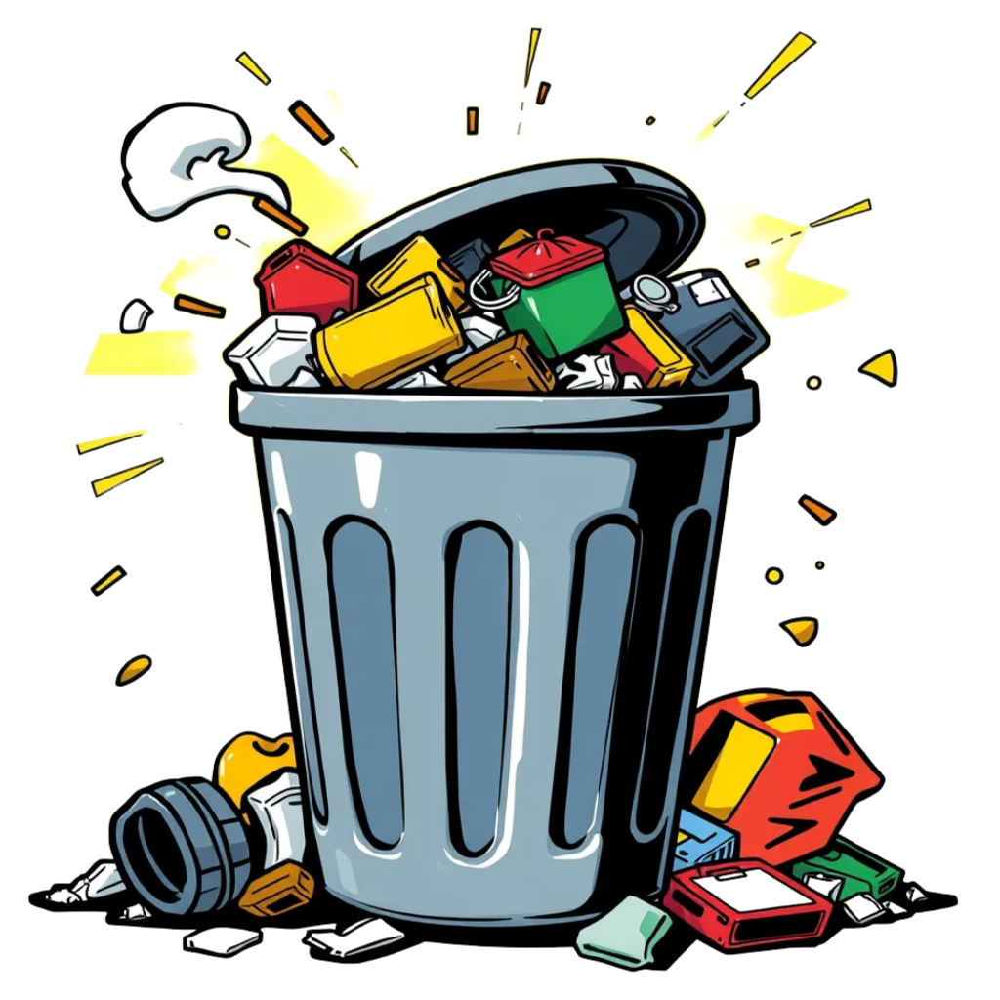

# 🗑️ Trash Coin - An Artistic Experiment Turning Garbage into Gold

## 🔥 Project Overview

**Trash Coin** is a satirical art project designed to deliver sharp criticism of contemporary consumerism, environmental pollution, and cryptocurrency bubbles through the simulation of a cryptocurrency. In a world drowning in garbage, we've created a "currency" to match.

> *"The world is a dumpster, and we're the kings."*

## 🎭 Artistic Value

Trash Coin is not just a website or a simulated token, it is:

- **Social Commentary**: A critical reflection on overconsumption and digital asset bubbles
- **Visual Art**: A fusion of horror elements, ruin aesthetics, and postmodern design language
- **Conceptual Art**: An exploration of the nature of "value" and how humans deify worthless things
- **Interactive Experience**: A visual demonstration of the consequences of consumerism through falling and accumulating trash animations

## 💻 Technical Features

- **Horror Theme Aesthetics**: Creating unease through fonts like Nosifer and Creepster
- **Blood Drip Animation Effects**: Key words emphasized in blood red with dripping animations
- **Trash Falling System**: Simulation of trash continuously generating and accumulating at the bottom
- **Ruin-style Text**: Creating a sense of decay through Special Elite and Sedgwick Ave Display fonts
- **Responsive Design**: Perfect adaptation to various device sizes

## 🛣️ Project Roadmap

1. **The Pile Stage**: Symbolizing the unlimited expansion of consumerism
2. **The Melt Stage**: Representing the distortion and deformation of values
3. **The Gold Illusion Stage**: Satirizing how worthless things are given false value

## 🌐 Experience the Project

Visit our [official website](https://trashcoin.art) to experience this satirical art project firsthand.

You can also experience simulated trading through [Uniswap](https://app.uniswap.org/) (Note: This is just part of the art project and does not involve actual trading).

## 🤝 Join the Discussion

- [Twitter](https://twitter.com/trashcoin)
- [Telegram](https://t.me/trashcoin)

## ⚠️ Disclaimer

Trash Coin is a pure art project, not a real cryptocurrency or investment tool. The project aims to provoke thought and discussion about consumerism, environmental issues, and digital asset bubbles.

## 📜 License

This project is licensed under the [MIT License](LICENSE).

---

*"If we're destined to drown in garbage, we might as well profit from it."* - Trash Coin Manifesto 